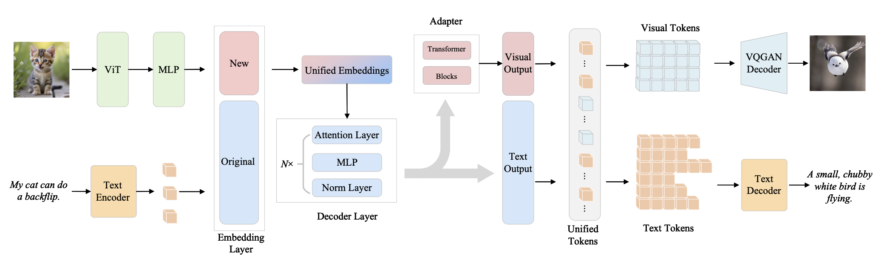
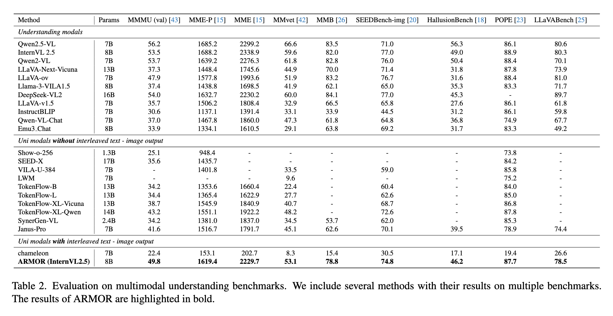
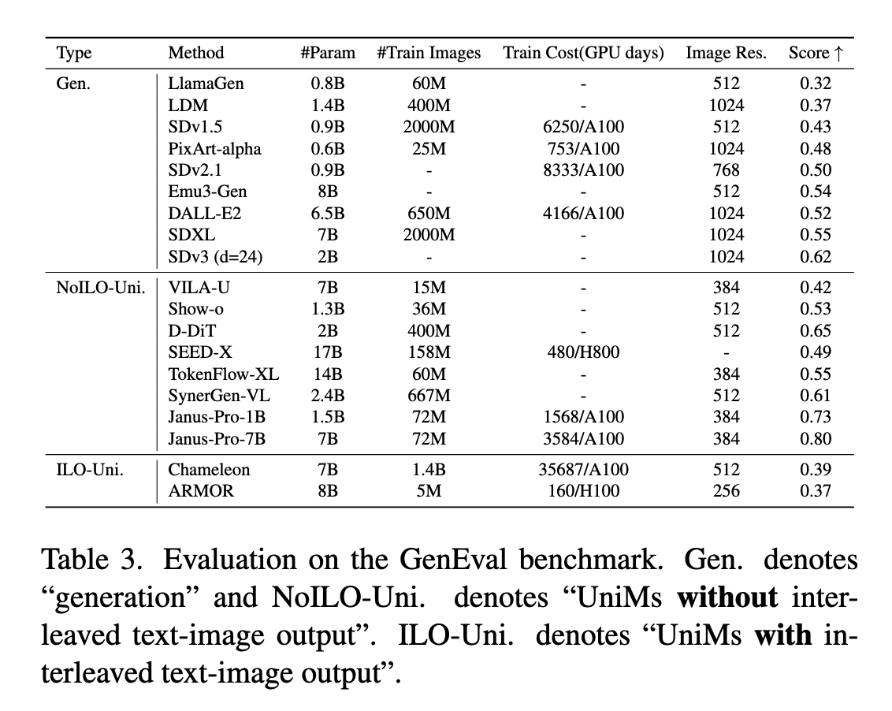

<div align="center">
<!-- <h1>
    <span style="color: #0066ff;">AR</span><span style="color: orange;">M</span>OR: 
    Empowering <span style="color: #0066ff;">Autoregressive</span> 
    <span style="color: orange;">Multimodal</span> Understanding Model with Interleaved Multimodal Generation via Asymmetric Synergy
</h1> -->
<h1>
    <font color="#0066ff">AR</font><font color="orange">M</font>OR: 
    Empowering <font color="#0066ff">Autoregressive</font> 
    <font color="orange">Multimodal</font> Understanding Model with Interleaved Multimodal Generation via Asymmetric Synergy
</h1>

[**Jianwen Sun**]()<sup>1,2*</sup> · [**Yukang Feng**]()<sup>1,2*</sup> · [**Chuanhao Li**]()<sup>5</sup>· [**Fanrui Zhang**]()<sup>2,3</sup> <br> [**Zizhen Li**]()<sup>1,2</sup> ·
[**Jiaxin Ai**]()<sup>2,4</sup> · [**Sizhuo Zhou**]()<sup>2,3</sup> · [**Pengfei Zhou**]()<sup>5</sup> 
<br>
[**Yu Dai**]()<sup>1</sup> · [**Shenglin Zhang**]()<sup>1</sup> · [**Kaipeng Zhang**]()<sup>2,5&dagger;</sup>

<sup>1</sup>Nankai University&emsp;&emsp;&emsp;<sup>2</sup>Shanghai Innovation Institute<br>&emsp;&emsp;&emsp;<sup>3</sup>University of Science and Technology of China&emsp;&emsp;
<sup>4</sup>WUHAN University&emsp;&emsp;&emsp;<br><sup>5</sup>Shanghai AI Laboratory<br>&emsp;&emsp;&emsp;
<br>
*equal contribution&emsp;&emsp;&emsp;&dagger;corresponding author

<a href="https://arxiv.org/abs/2503.06542"></a>
<a href=""></a>
<a href=""></a>

</div>


## 💡 News
- `2025/03/09`: The technical report of [ARMOR](#TODO) is released! Our code will be released soon.

## 📖 Introduction
This repo implements ARMOR, a unified visual tokenizer well-suited for both generation and understanding tasks. It operates within a single autoregressive framework to enable interleaved image-text inputs and outputs, autonomously selecting the most appropriate response modality depending on the query.

## 📖 Overview



Armor is a unified understanding and generation model improved based on a multimodal large language model (MLLM). It operates within a single autoregressive framework to enable interleaved image-text inputs and outputs, autonomously selecting the most appropriate response modality depending on the query. Building upon a pretrained MLLM, Armor employs a unified embedding space to represent both textual and visual information, thus reducing model complexity, and introduces an asymmetric encoder-decoder to unify generation and understanding. Through training on a meticulously curated, high-quality dataset of interleaved text and images with our proposed What or How to Generate (WoHG) method, Armor not only preserves much of the original model’s capabilities but also achieves  impressive image generation performance. Coupled with a forward-switching mechanism, Armor enables highly natural text-image interleaved output, all while requiring minimal computational resources. The research findings indicate that enhancing a pretrained MLLM with an autoregressive architecture and an asymmetric encoder-decoder demonstrates substantial potential and research value for developing unified understanding and generation models. Furthermore, the results also reaffirm that a fully autoregressive approach remains a promising foundation for building unified large-scale model architectures.

## 🏆 Expirement

### Understanding Performance


### Generation Performance



## 📞 Contact
- Jianwen Sun: sunjianwen@mail.nankai.edu.cn
- Yukang Feng: yukangfeng@mail.nankai.edu.cn
- Kaipeng Zhang: zhangkaipeng@pjlab.org.cn
## 🖊️ Citation 
If you feel ARMOR useful in your project or research, please kindly use the following BibTeX entry to cite our paper. Thanks!
```bibtex
@misc{sun2025armorv01empoweringautoregressive,
    title={ARMOR v0.1: Empowering Autoregressive Multimodal Understanding Model with Interleaved Multimodal Generation via Asymmetric Synergy}, 
    author={Jianwen Sun and Yukang Feng and Chuanhao Li and Fanrui Zhang and Zizhen Li and Jiaxin Ai and Sizhuo Zhou and Yu Dai and Shenglin Zhang and Kaipeng Zhang},
    year={2025},
    eprint={2503.06542},
    archivePrefix={arXiv},
    primaryClass={cs.CV},
    url={https://arxiv.org/abs/2503.06542}, 
}
